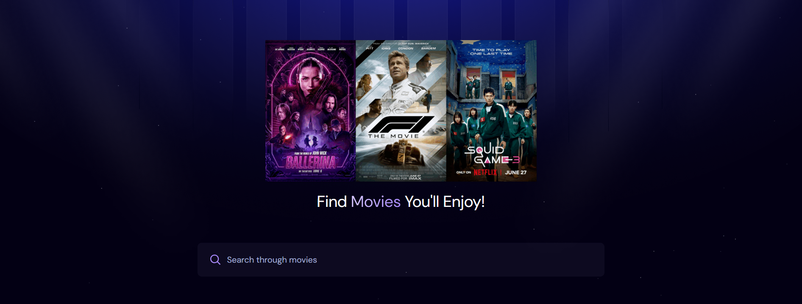
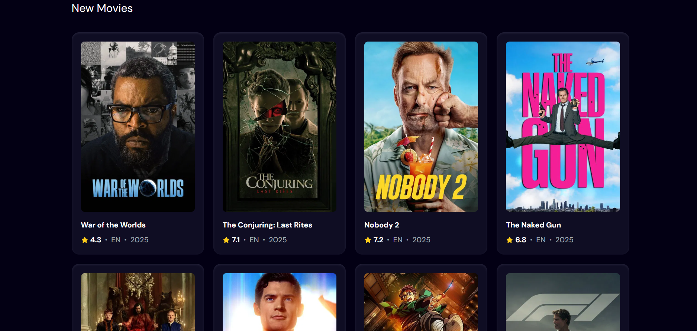

# 🎬 Movie Discovery App

A modern React application for discovering and tracking trending movies using TMDB API and Appwrite backend.

## ✨ Features

- 🔍 Real-time movie search with debounced API calls
- 📈 Trending movies tracking based on search analytics
- 🎨 Modern UI with Tailwind CSS and custom animations
- 📱 Fully responsive design
- ⚡ Fast performance with Vite
- 🗄️ Backend integration with Appwrite for analytics

## 🛠️ Tech Stack

- **Frontend**: React 19, Vite, Tailwind CSS
- **Backend**: Appwrite (Database, Analytics)
- **API**: The Movie Database (TMDB)
- **Styling**: Custom CSS with Tailwind utilities
- **Build Tool**: Vite with HMR

## 📸 Screenshots





## 🏃‍♂️ Getting Started

### Prerequisites

- Node.js 18+
- npm or yarn
- TMDB API key
- Appwrite account

### Installation

1. Clone the repository

```bash
git clone https://github.com/yourusername/movie-discovery-app.git
cd movie-discovery-app
```

2. Install dependencies

```bash
npm install
```

3. Set up environment variables

```bash
cp .env.example .env.local
```

4. Configure your `.env.local`:

```env
VITE_TMDB_API_KEY=your_tmdb_api_key
VITE_APPWRITE_PROJECT_ID=your_project_id
VITE_APPWRITE_DATABASE_ID=your_database_id
VITE_APPWRITE_TABLE_ID=your_table_id
```

5. Start the development server

```bash
npm run dev
```

## 🏗️ Project Structure

```
src/
├── components/         # Reusable UI components
│   ├── MovieCard.jsx   # Movie display component
│   ├── Search.jsx      # Search input component
│   └── Spinner.jsx     # Loading spinner
├── appwrite.js         # Appwrite configuration and API calls
├── App.jsx             # Main application component
└── index.css           # Global styles and Tailwind config
```

## 🔧 API Integration

### TMDB API

- Movie search and discovery
- Popular movies fetching
- Movie details and metadata

### Appwrite Backend

- Search analytics tracking
- Trending movies calculation
- Real-time data updates

## Performance Features

- Debounced search (500ms delay)
- Optimized API calls
- Image lazy loading
- Responsive design patterns
